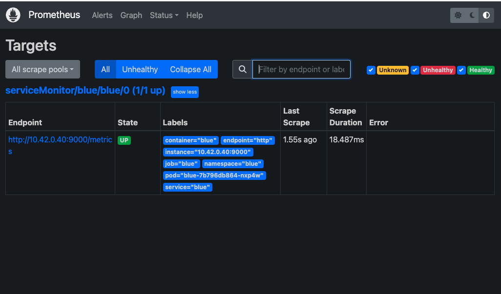
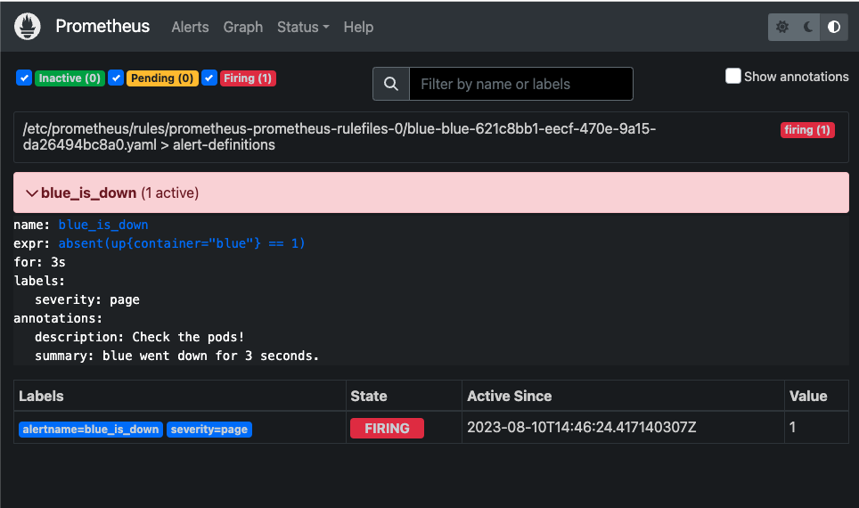

## Big Bang Prometheus

_This capability creates a ServiceMonitor and PrometheusRule for your app by adding [three lines of yaml](https://github.com/cmwylie19/bb-prometheus/blob/5f8ff9c2055d669b793340e575323140f67f7ee5/README.md?plain=1#L100) to a service._

1. Container to watch for the PromRule
2. Prometheus scrape label
3. Port that emits metrics

_Run K3d for this demo!_

- [Prometheus Dependency](#prometheus-dependency)
- [Run Pepr](#run-pepr)
- [Deploy App](#deploy-app)
- [View Results](#view-results)

## Prometheus Dependency

Install Prometheus Bundle for testing

```bash
kubectl create -f https://raw.githubusercontent.com/prometheus-operator/prometheus-operator/main/bundle.yaml
```

Deploy Prometheus Instance with required perms

```bash
kubectl create -f -<<EOF
apiVersion: monitoring.coreos.com/v1
kind: Prometheus
metadata:
  name: prometheus
  labels:
    prometheus: prometheus
spec:
  replicas: 1
  scrapeInterval: 3s
  serviceAccountName: prometheus-operator
  serviceMonitorSelector: {}
  serviceMonitorNamespaceSelector: {}
  ruleNamespaceSelector: {}
  ruleSelector: {}
---
apiVersion: rbac.authorization.k8s.io/v1
kind: ClusterRole
metadata:
  creationTimestamp: null
  name: prom-scrape
rules:
- apiGroups:
  - ""
  resources:
  - pods
  - endpoints
  - services
  verbs:
  - get
  - watch
  - list
---
apiVersion: rbac.authorization.k8s.io/v1
kind: ClusterRoleBinding
metadata:
  creationTimestamp: null
  name: prom-scrape-binding
roleRef:
  apiGroup: rbac.authorization.k8s.io
  kind: ClusterRole
  name: prom-scrape
subjects:
- kind: ServiceAccount
  name: prometheus-operator
  namespace: default
EOF
```

## Run Pepr

In a JavaScript Debug Terminal

```bash
npx pepr dev
```

## Deploy App

This app emits metrics

```bash
kubectl apply -f -<<EOF
apiVersion: v1
kind: Namespace
metadata:
  creationTimestamp: null
  name: blue
spec: {}
status: {}
---
apiVersion: v1
kind: Service
metadata:
  labels:
    app: blue
    version: v1
    scrape-port: http # Capability label
    prometheus: scrape # Capability label
    container: blue # Capability label
  name: blue
  namespace: blue
spec:
  ports:
    - port: 9000
      name: http
  selector:
    app: blue
  type: ClusterIP
---
apiVersion: apps/v1
kind: Deployment
metadata:
  labels:
    app: blue
    version: v1
  name: blue
  namespace: blue
spec:
  selector:
    matchLabels:
      app: blue
      version: v1
  replicas: 1
  template:
    metadata:
      labels:
        app: blue
        version: v1
    spec:
      serviceAccountName: blue
      containers:
        - image: docker.io/cmwylie19/metrics-demo
          name: blue
          resources:
            requests:
              memory: "64Mi"
              cpu: "250m"
            limits:
              memory: "128Mi"
              cpu: "500m"
          ports:
            - containerPort: 9000
              name: http
          imagePullPolicy: Always
      restartPolicy: Always
---
apiVersion: v1
kind: ServiceAccount
metadata:
  name: blue
  namespace: blue
EOF
```

## View Results

Port-Forward to [Prom-UI](http://localhost:9090/targets?search=) and check targets, and rules.

```bash
kubectl port-forward svc/prometheus-operated 9090 
```
  

Now, you can take down the deployment for blue to see the PrometheusRule trigger.

```bash
kubectl scale deploy/blue -n blue --replicas=0
```

  

The PrometheusRule could take up to 1 minute or 2 to fire.

[top](#big-bang-prometheus)

